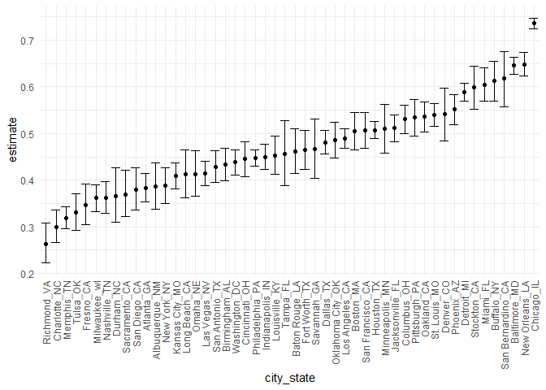

P8105 Homework 5
================
Ruiyang Li
2020-11-14

This is my solution to HW5.

## Problem 1

Read in the data.

``` r
homicide_df = 
  read_csv("homicide_data/homicide-data.csv") %>% 
  mutate(
    city_state = str_c(city, state, sep = "_"),
    resolved = case_when(
      disposition == "Closed without arrest" ~ "unsolved",
      disposition == "Open/No arrest"        ~ "unsolved",
      disposition == "Closed by arrest"      ~ "solved",
    )
  ) %>% 
  select(city_state, resolved) %>% 
  filter(city_state != "Tulsa_AL")
```

A quick look at homicides.

``` r
aggregate_df = 
  homicide_df %>% 
  group_by(city_state) %>% 
  summarize(
    hom_total = n(),
    hom_unsolved = sum(resolved == "unsolved")
  )
## `summarise()` ungrouping output (override with `.groups` argument)
```

A prop test for Baltimore, MD.

``` r
prop.test(
  aggregate_df %>% filter(city_state == "Baltimore_MD") %>% pull(hom_unsolved), 
  aggregate_df %>% filter(city_state == "Baltimore_MD") %>% pull(hom_total)) %>% 
  broom::tidy()
## # A tibble: 1 x 8
##   estimate statistic  p.value parameter conf.low conf.high method    alternative
##      <dbl>     <dbl>    <dbl>     <int>    <dbl>     <dbl> <chr>     <chr>      
## 1    0.646      239. 6.46e-54         1    0.628     0.663 1-sample~ two.sided
```

Iterate.

``` r
results_df = 
  aggregate_df %>% 
  mutate(
    prop_tests = map2(.x = hom_unsolved, .y = hom_total, ~prop.test(x = .x, n = .y)),
    tidy_tests = map(.x = prop_tests, ~broom::tidy(.x))
  ) %>% 
  select(-prop_tests) %>% 
  unnest(tidy_tests) %>% 
  select(city_state, estimate, conf.low, conf.high)
```

Plot the estimates and CIs for each city.

``` r
results_df %>% 
  mutate(city_state = fct_reorder(city_state, estimate)) %>% 
  ggplot(aes(x = city_state, y = estimate)) +
  geom_point() + 
  geom_errorbar(aes(ymin = conf.low, ymax = conf.high)) + 
  theme(axis.text.x = element_text(angle = 90, vjust = 0.5, hjust = 1))
```



## Problem 2

Create a tidy dataframe containing data from all participants, including
the subject ID, arm, and observations over time.

``` r
lda_df = 
  tibble(file = list.files("lda_data")) %>% 
  mutate(
    path = str_c("lda_data/", file),
    data = map(.x = path, ~read_csv(.x))) %>% 
  unnest(data) %>% 
  select(-path) %>% 
  mutate(file = str_remove(file, ".csv")) %>% 
  separate(file, into = c("arm", "subj_id"), sep = "_") %>% 
  pivot_longer(
    week_1:week_8, 
    names_to = "week", 
    names_prefix = "week_", 
    values_to = "observation"
  ) %>% 
  mutate(week = as.numeric(week)) %>% 
  relocate(subj_id)

head(lda_df)
## # A tibble: 6 x 4
##   subj_id arm    week observation
##   <chr>   <chr> <dbl>       <dbl>
## 1 01      con       1        0.2 
## 2 01      con       2       -1.31
## 3 01      con       3        0.66
## 4 01      con       4        1.96
## 5 01      con       5        0.23
## 6 01      con       6        1.09
```

Make a spaghetti plot showing observations on each subject over time.

``` r
lda_df %>% 
  group_by(subj_id, arm, week) %>% 
  ggplot(aes(x = week, y = observation, group = subj_id, color = subj_id)) +
  geom_point() + geom_path() +
  facet_grid(~arm) +
  labs(title = "Observations on each subject over time", 
       x = "Week", 
       y = "Observations", 
       color = "Subject")
```


Comment on differences between groups:

  - At week 1, mean observations across subjects in both groups look
    similar, but those in the control group have less variation than
    those in the experiment.
  - Over time, the observations in the control group seem to be constant
    and do not vary much within both group level and individual level.
    The mean of the observations in the control group at each week is
    around 1.
  - Over time, the observations in the experiment group seem to have an
    increasing trend within both group level and individual level. The
    mean of the observations in the experiment group starts at around 1
    and gradually goes to around 5.
